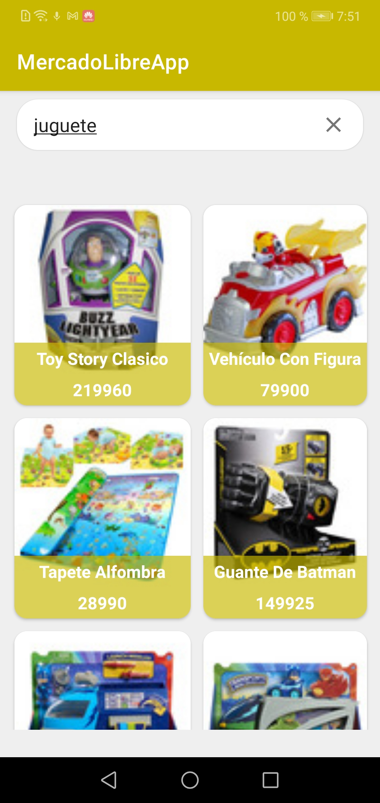

# MercadoLibreApp

Éste es el proyecto prueba de mercado libre, con esta app se puede buscar un producto y ver su detalle. 

## Experiencia de usuario

Este proyecto contiene las siguientes características.

* Una pantalla de inicio con un menú al pie de la pantalla con las siguientes opciones:
    * Una barra de busqueda de productos, luego de buscar en esta:
    * Un listado de los productos.
* Una pantalla de detalle del producto que muestra información adicional (precio, nombre, cantidad disponible, dirección del vendedor).

## Capturas de pantalla

  
  

## Guía de implementación

### Trabajando con la API de Mercado Libre

Este proyecto implementa el API de mercado libre. Para conocer más sobre su uso visita su página: https://developers.mercadolibre.com.ar/es_ar/items-y-busquedas

### Arquitectura

Este proyecto sigue buenas prácticas de la arquitectura limpia (Clean Architecture) planteada por Robert C. Martin para hacer un código más independiente, mantenible y sencillo para generar pruebas unitarias.

#### Capas

* App: UI.
* Presentación: View Models.
* Casos de uso: GetProductsBySearchUseCase,  etc.
* Dominio: Product, Seller, Address, etc.
* Datos: ProductRepository, RemoteProductsDataSource, etc.
* Framework: ImageManager,  RequestManager.

Este proyecto usa ViewModel para almacenar y manejar datos, así como comunicar cambios hacia la vista.

Este proyecto usa LiveData para manejar la navegación y los valores en la aplicación.

### Administrador de solicitudes: Retrofit

Este proyecto utiliza Retrofit para proporcionar una lista de productos y su información desde una API.

### Biblioteca de imágenes - Glide

Este proyecto utiliza Glide para cargar las imágenes de los productos. Para el uso de placeholders se manejan íconos proporcionados por la página de Material Design (https://material.io/resources/icons/).

### Inyección de dependencia - Dagger

Este proyecto utiliza Dagger para gestionar la inyección de dependencia.

## Copyright

The API of Mercado Libre used in this project is provided by the following site: https://developers.mercadolibre.com.ar/es_ar/items-y-busquedas
